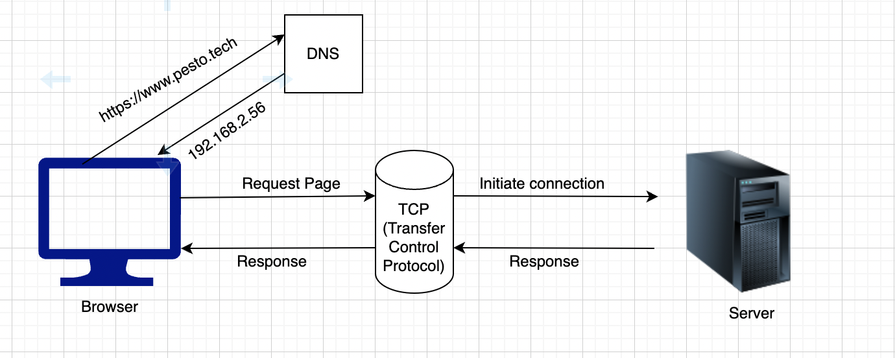
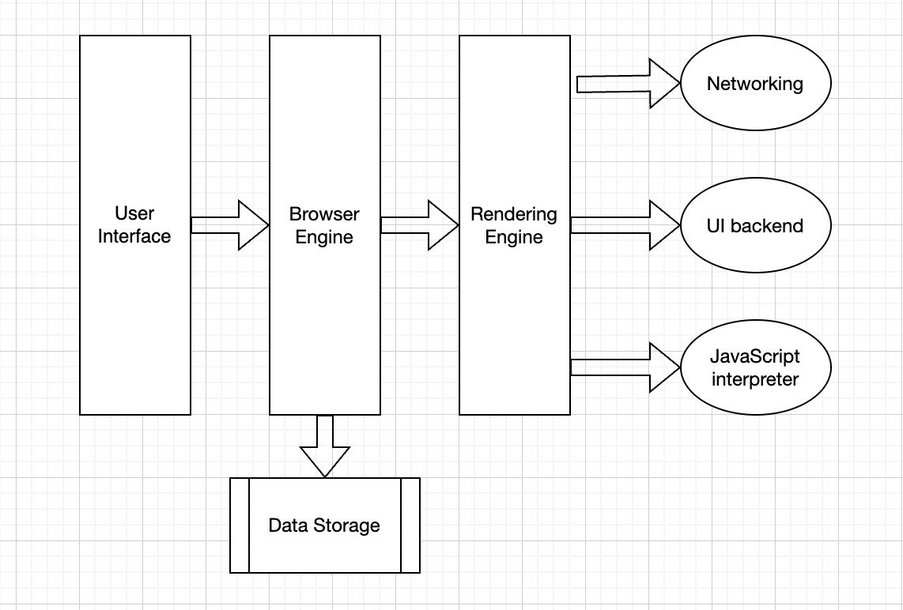

# Exercise1.1

## _When a user enters an URL in the browser, how does the browser fetch the desired result ?_

# URLs

URL stands for Uniform Resource Locator. It is an address of website which we want to access. URL indicating resource on the internet like image, text, hypertext pages, audio files, video files etc.

URLs contain protocol, domain name, path name
URL Example : https://www.pesto.tech/become-a-developer

- Protocol :- https://
- Domain :- www.pesto.tech
- Path :- become-a-developer

> When a user enter an URL in web browser’s address bar, the browser looks up the IP address for the domain name using DNS (Domain Name System). Browser initiates a connection with the server using Transfer Control Protocol. Browser sends an HTTP request to the web server. Server handles request and sends back response to the browser. Browser render the HTML and other resource to the users. Once page loaded, browser sends further requests which is initiate by users.

## High Level Components of a browser

1. The user interface
2. The browser engine
3. The rendering engine
4. Networking
5. UI backend
6. JavaScript interpreter
7. Data storage

## The rendering engine:

After request a particular resource from user, the render engine start fetching content of the requested resource. Render engine start receiving the content of that specific document in chunks from networking layer. After receiving content flow the rendering begins as mention below,

## Parsing

We have a HTML content initially which goes through tokenisation process where code split into several tokens for parsing. Using token HTML parser understand the which tag and what is inside the tag.

## Layout

In Layout, elements are marked on screen. It is contain position of element, properties related to the position.

### Paint

Paint takes properties like color, background-color, border-color, box-shadow, etc. to paint the screen with colors.
